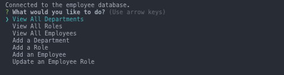
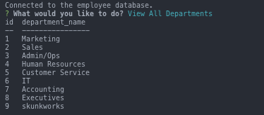
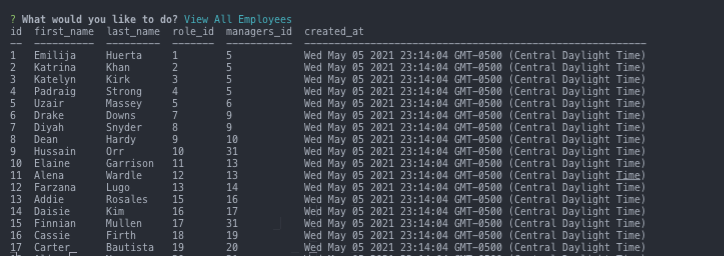

# Employee Tracker

## Description
Employee Tracker is a Node.js application that uses Inquirer's NPM package to prompt user to either create, read, update, and delete employee records. Employee Tracker uses mySQL to store pertinent information about a companies' employee records, including but not limited to name, role, salary, and their direct supervisor.

This application was built using mySQL Workbench to run queries and seed the database. Once the database was seeded, the application switches through a series of prompts via the commandline. 

## Functionality
* Created a database and tables using mySQL shell
* Performed CRED operations on a table using INSERT, SELECT, UPDATE and DELETE
* Connected to a MySQL database from Node.js.
* Executed SQL queries using inquirer prompts
* Made changes to a database schema with DROP statements.
* Combined relational data using JOIN statements.
* Added constraints to remove references to deleted data.
* Implemented SQL timestamps to track when data is created.
* Used ORDER BY clauses to sort data numerically.
* Created a dotenv file and connection to prevent mySQL password from being passed to a public repository

## Languages
* Javascript
* Node.js
* mySQL
* Inquirer NPM Package
* dotenv

## Get Started
### Installation
* Clone repository to a desired location on your computer
* open terminal, navigate to file, type `npm install` on the command line
* open repository in your code editor
* create a .env file in the root directory
* in the .env file, type `DB_PW: 'mySQL Password'`
* once the application has been installed and a dotenv with your mySQL password has been created, open mySQL Workbench.
### Create Database, Tables, and Seeds
* When mySQL workbench is running and you are running mySQL on a new local instance, open a new query tab so that you can create a database, create tables, and seed the database. If you do not have mySQL workbench, open 
* In a new query tab, copy the code from db directory, paste and run mySQL queries starting with `db.sql`, `schema.sql`, and then `seeds.sql`

### Start Application
open a new  type `npm run seed` to seed the database with dummy data and `npm start` to start the application.
* use the arrow keys and prompts to navigate the application. 

## Video
<a href="https://www.loom.com/share/9930b1aa7a254f5b96f0e287540bf396">
    
Google Chrome - joshacross/employee-tracker - Watch Video

    
  </a>

## Reference Images

